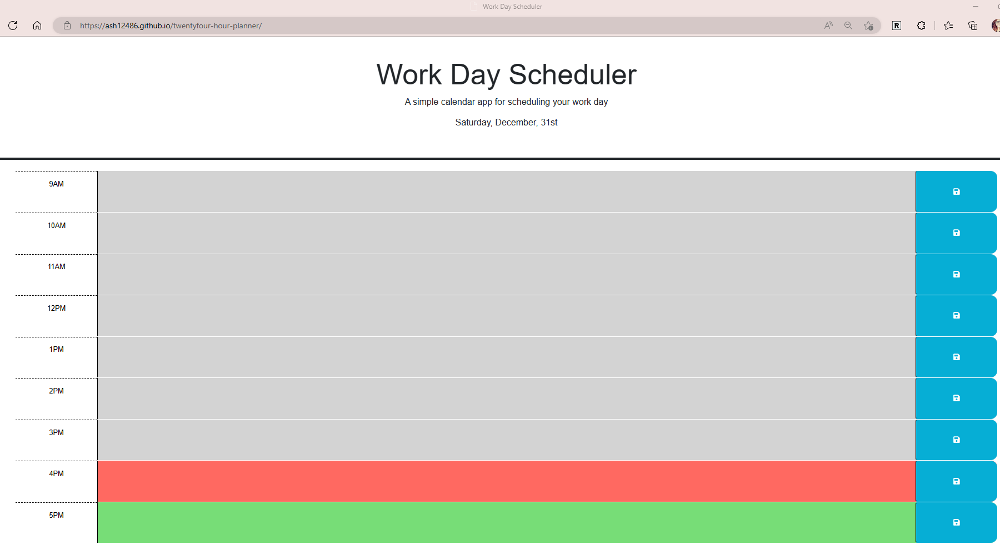

# twentyfour-hour-planner

## DESCRIPTION
This is a basic work-day planner that allows the user to save text on each hour block. The block colors reflect past times (grey), present times (orange), and future times (green). Once text is saved it is saved in locagestorage, and will stay there until the browser is closed.

## USER STORY
AS AN employee with a busy schedule
I WANT to add important events to a daily planner
SO THAT I can manage my time effectively

## ACCEPTANCE CRITERA
GIVEN I am using a daily planner to create a schedule
WHEN I open the planner
THEN the current day is displayed at the top of the calendar
WHEN I scroll down
THEN I am presented with time blocks for standard business hours
WHEN I view the time blocks for that day
THEN each time block is color-coded to indicate whether it is in the past, present, or future
WHEN I click into a time block
THEN I can enter an event
WHEN I click the save button for that time block
THEN the text for that event is saved in local storage
WHEN I refresh the page
THEN the saved events persist

## SCREENSHOTS
Live URL : https://ash12486.github.io/twentyfour-hour-planner/

## MOCK-UP IMAGE
This is what the result should look like.

## DESIGNER NOTES
* This program uses jQuery and Bootstrap
